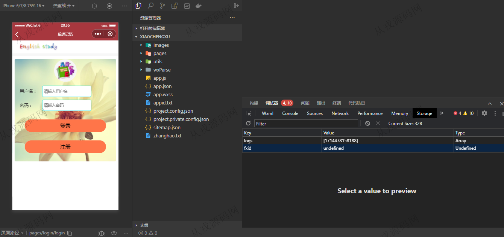
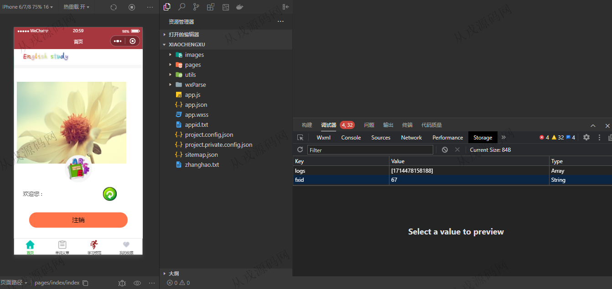
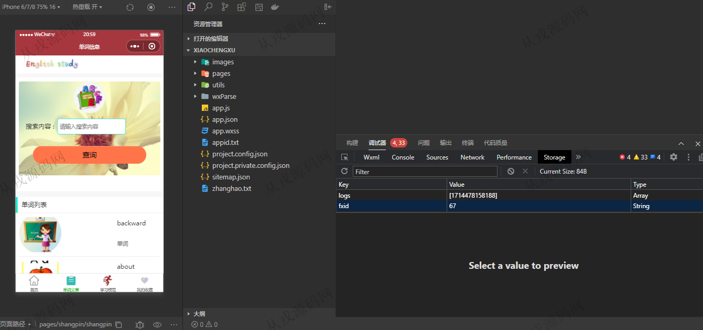
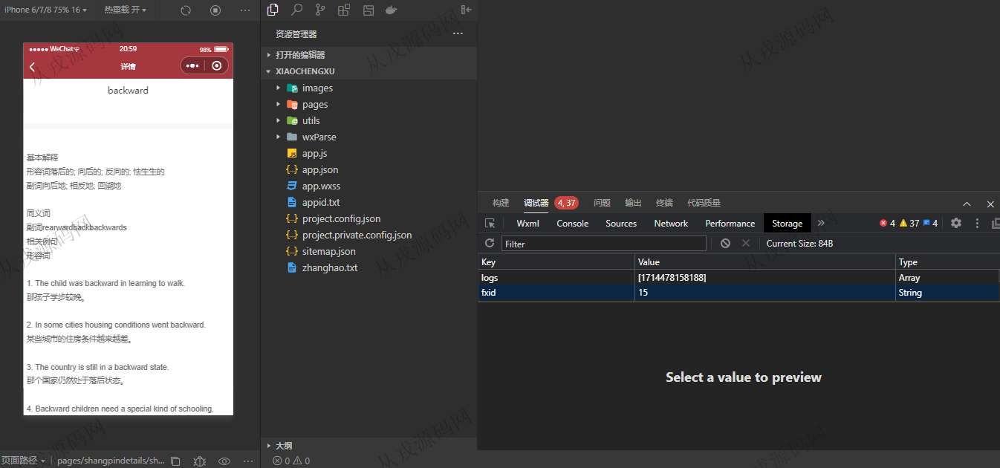
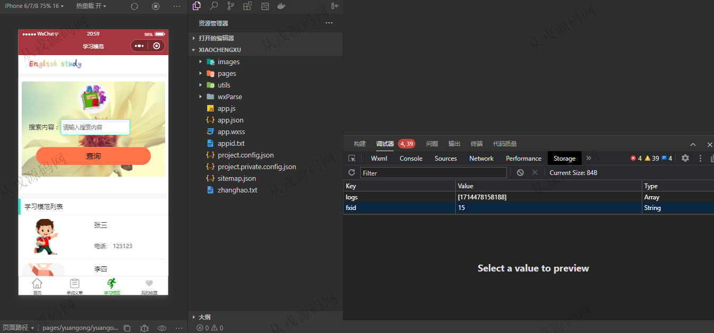
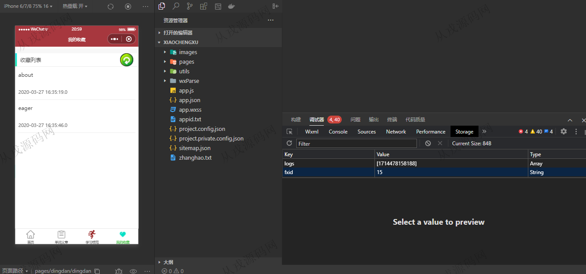
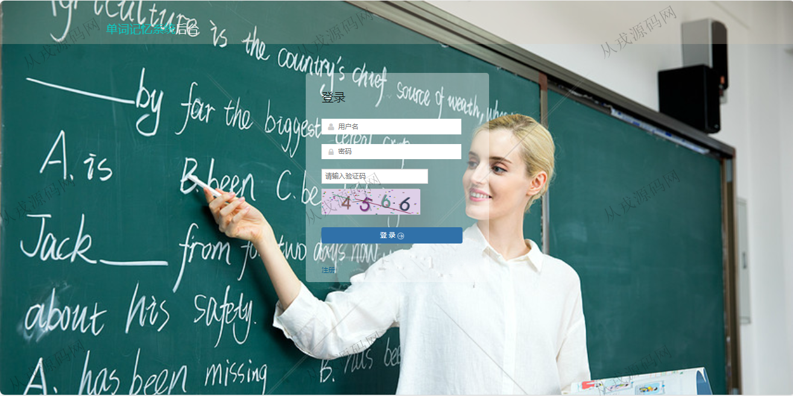
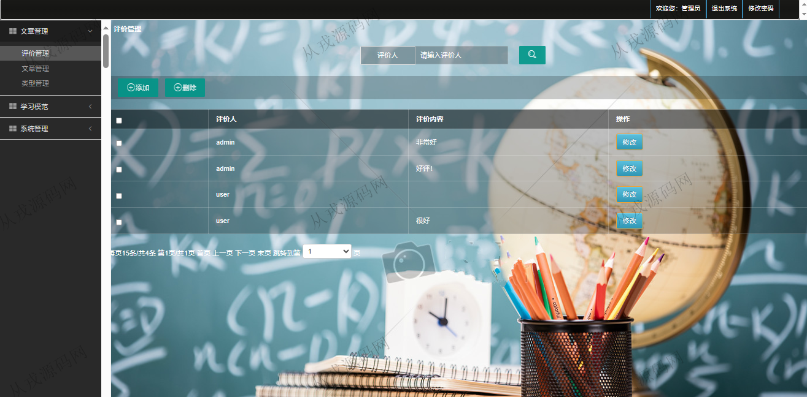
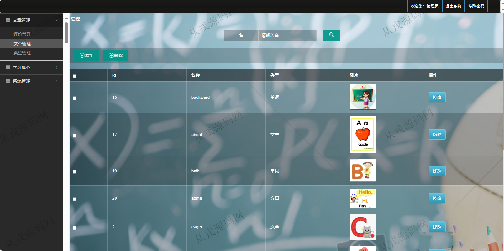

<h1 align="center">254.基于小程序的单词记忆小程序管理系统【含报告文档】</h1>

 获取sql文件 QQ: 386869957 QQ群: 377586148 

 [更多源码项目: 从戎源码网](https://armycodes.com/) 

## 简介

> 本代码来源于网络,仅供学习参考使用!
>
> 提供1.远程部署/2.修改代码/3.设计文档指导/4.框架代码讲解等服务
>
> 小程序用户: user 密码: 123456
>
> 后端登录地址：http://localhost:8080/danci/media/login.jsp
>
> 管理员: admin   密码: 123456
>

## 项目介绍
基于小程序的单词记忆小程序管理系统【含报告文档】：前端 小程序、jsp、jquery，后端 springmvc、spring、mybatis；角色分为管理员、用户；集成单词列表、学习模范、我的收藏、文章管理、评价管理等功能于一体的系统。

## 环境

- <b>IntelliJ IDEA 2021.3</b>

- <b>Mysql 5.7.26</b>

- <b>Tomcat 7.0.73</b>

- <b>JDK 1.8</b>

- <b>微信开发者工具</b>

## 运行截图

